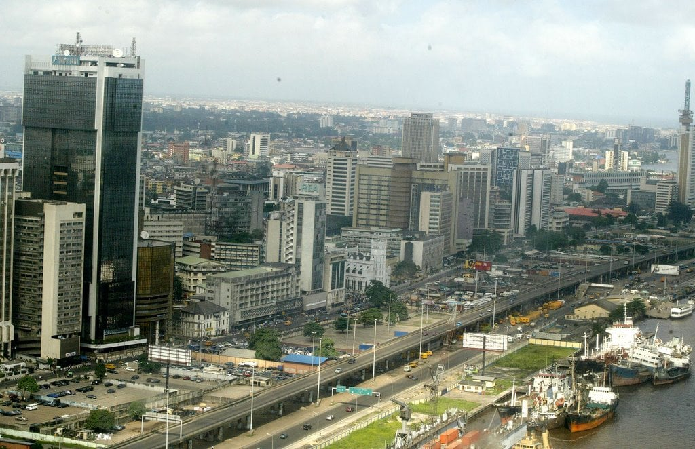

# Lagos-state-crime-Prediction

As the commercial hub of Nigeria and West Africa, Lagos State has witnessed significant and rapid urban growth. Due to the high concentration of banks, industries, companies, and other commercial enterprises, it has become a natural target for criminals. Consequently, the crime rate in Lagos is much higher than in other regions of the country. 

This project uses machine learning algorithms, to analyze and predict crime patterns within the region. it focuses on detecting, predicting, and elucidating crime patterns and hotspots across the Local Council Development Areas (LCDAs) within Lagos State. 

# Analysis Model Implementation

