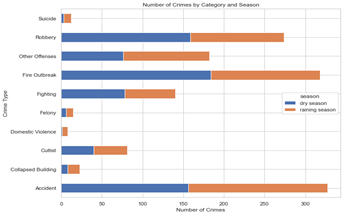
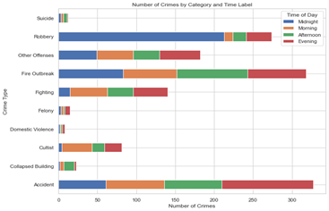
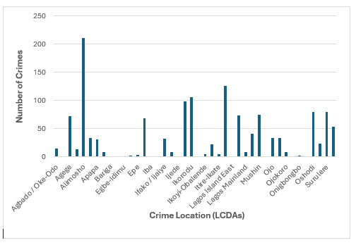
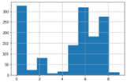
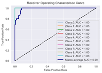
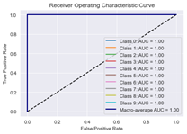
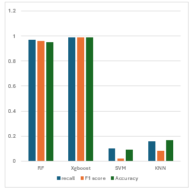

# Lagos-state-crime-Prediction

As the commercial hub of Nigeria and West Africa, Lagos State has witnessed significant and rapid urban growth. Due to the high concentration of banks, 
industries, companies, and other commercial enterprises, it has become a natural target for criminals. Consequently, the crime rate in Lagos is much higher 
than in other regions of the country. 

This project uses machine learning algorithms, to analyze and predict crime patterns within the region. it focuses on detecting, predicting,
and elucidating crime patterns and hotspots across the Local Council Development Areas (LCDAs) within Lagos State. 

# Analysis and Model Implementation

This project is based upon a comprehensive dataset source from the RRS (Rapid Response Squared) ledger spanning from December 2019 to 2022, 
encompassing 1428 entries across 10 distinct crime attributes.

  

 

  

# Conclusion

The crime analysis revealed a concerning trend of crime concentrated in specific areas of Lagos. Local Government Areas (LCDAs) 
like Alimosho, Kosofe, Ikorodu, Ikeja, Oshodi, Surulere, and Mushin emerged as hotspots for criminal activity. 
These areas witnessed frequent incidents of robbery, cult violence, accidents, and fire outbreaks, particularly during the evenings and midnight hours. 
This analysis provides valuable insights for targeted interventions and improved security measures in these  LCD areas.
While Random Forest (RF) achieved a respectable accuracy of 95% and a perfect F1 score for some crime types, Xgboost emerged as 
the superior model for this multiclass classification task. Xgboost's dominance is evident in its near-perfect accuracy (99%) and 
F1 score of 1.0 for all crime classes. This performance can be attributed to the SMOTE technique, which effectively addressed the initial imbalance in the crime data.  

